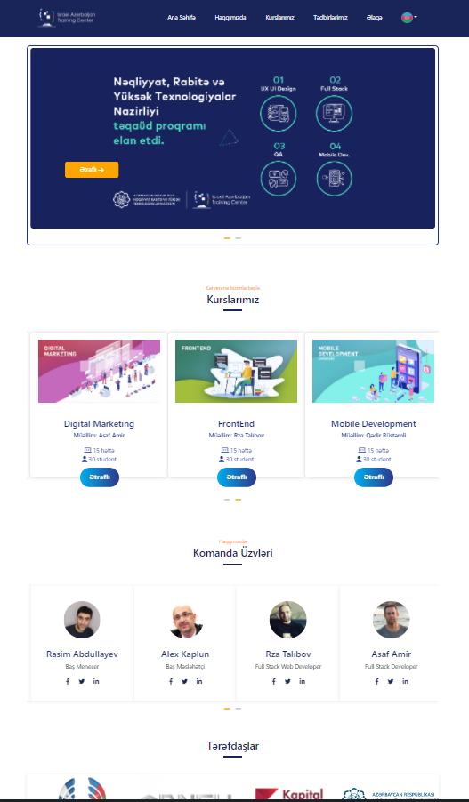

# IATC course website
## TECHNOLOGIES

- HTML
- CSS
- JAVASCRIPT
- JQUERY
- BOOTSTRAP
- FIREBASE

## PAGES
- [Ana Səhifə](https://semraab.github.io/webCourseWork/index.html)
- [Haqqımızda](https://semraab.github.io/webCourseWork/about.html)
- [Kurslarımız](https://semraab.github.io/webCourseWork/course.html)
- [Tədbirlər](https://semraab.github.io/webCourseWork/event.html)
- [Əlaqə](https://semraab.github.io/webCourseWork/contact.html)

# For admin Panel 
- [Ana Səhifə](https://semraab.github.io/webCourseWork/admin/about)

### Homepage

